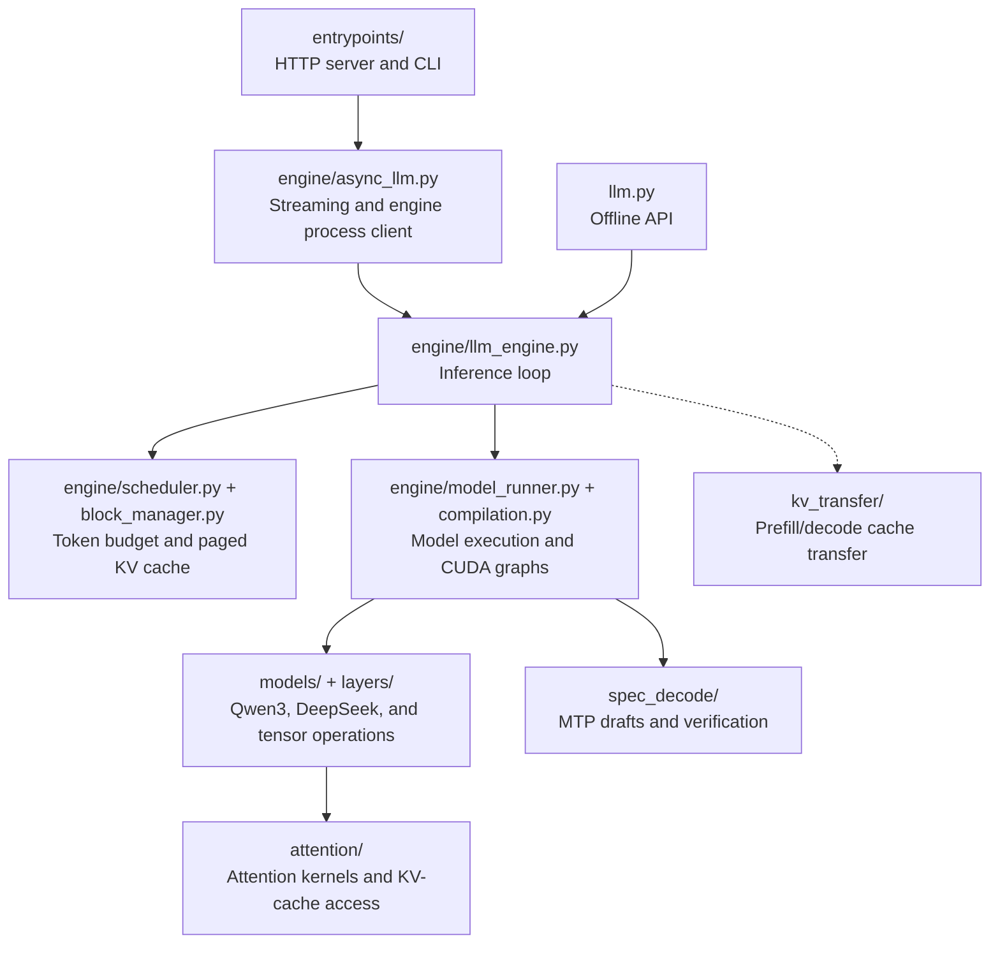
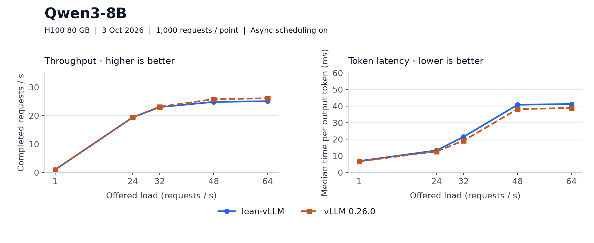
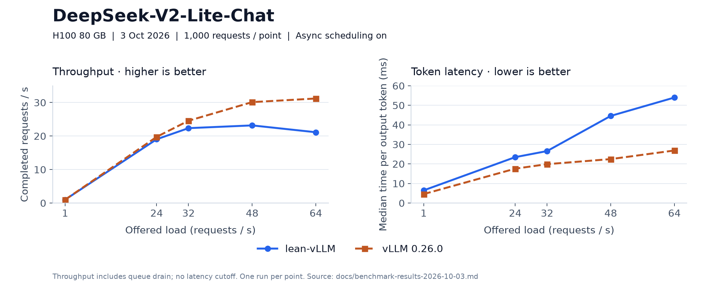

# lean-vLLM

A small inference engine for learning [vLLM](https://github.com/vllm-project/vllm)
and the concepts behind LLM inference by implementing them. Built on nano-vLLM,
with selected vLLM features and benchmarks against vLLM. Runs on CPU or NVIDIA
GPUs with CUDA.

## Beyond nano-vLLM

Building on [nano-vLLM's foundation](#credit), lean-vLLM adds these vLLM concepts:

- [Online serving](docs/online-serving.md): OpenAI-compatible streaming APIs,
  a separate engine process, cancellation, and Prometheus metrics.
- [Scheduling](lean_vllm/engine/scheduler.py): mixed chunked-prefill/decode batches,
  priority scheduling, and async CPU/GPU overlap.
- [Execution](lean_vllm/engine/compilation.py): piecewise Inductor compilation
  and CUDA graphs for prefill and mixed batches.
- [Attention backends](docs/attention-backends.md): per-layer selection of
  PyTorch, FlashAttention-3, FlashInfer, or FlashMLA.
- [DeepSeek models](docs/deepseek-v2.md): MLA, MoE, YaRN, Triton MoE kernels,
  and expert parallelism.
- [Speculative decoding](lean_vllm/spec_decode/): DeepSeek-V3 MTP drafting
  with rejection sampling.
- [Disaggregated prefill/decode](docs/disaggregated-prefill.md): separate
  engines connected by TCP KV-cache transfer and a proxy.

MTP and disaggregation have CPU checks; GPU validation is still pending.

## Repository structure



## Quick start

Requires Python 3.10–3.12 and [uv](https://docs.astral.sh/uv/).

```bash
uv sync
uv run hf download Qwen/Qwen3-0.6B --local-dir ./models/Qwen3-0.6B
```

```python
from lean_vllm import LLM, SamplingParams

llm = LLM("./models/Qwen3-0.6B", enforce_eager=True)
outputs = llm.generate(["Hello, lean-vLLM."], SamplingParams(max_tokens=256))
print(outputs[0]["text"])
```

Runs on CPU or NVIDIA CUDA. For GPU kernels, use `uv sync --extra cuda`;
see [backend requirements](docs/attention-backends.md#installing-the-kernels).
Supported architectures: Qwen3, DeepSeek-V2, and DeepSeek-V3. V3 is tested
only on tiny checkpoints, not at full scale; FP8 weights are not supported.

Serve the same model through the OpenAI-compatible API:

```bash
uv run lean-vllm serve ./models/Qwen3-0.6B --served-model-name qwen --port 8000
```

See the [client example](example_serving.py) and
[serving options](docs/online-serving.md). Run tests with `uv run pytest tests/`.

## Benchmarks

Latest recorded results: 3 October 2026, one H100 80 GB, vLLM 0.26.0,
1,000 requests per point, async scheduling enabled on both engines.





The figures use numbers from the [results table](docs/benchmark-results-2026-10-03.md).
For detailed analysis, see the 3 October reports for
[Qwen3-8B](docs/benchmark-2026-10-03-Qwen3-8B.md) and
[DeepSeek-V2-Lite](docs/benchmark-2026-10-03-DeepSeek-V2-Lite.md).

## Credit

Forked from [nano-vLLM](https://github.com/GeeeekExplorer/nano-vllm) by Xingkai Yu
at [`bb823b3`](https://github.com/GeeeekExplorer/nano-vllm/commit/bb823b3e06983d71485a8e1f23715ebd87d98ef8).
Its scheduler, block manager, paged KV cache, and Qwen3 implementation form
the foundation of this project. Both projects use the [MIT license](LICENSE).
